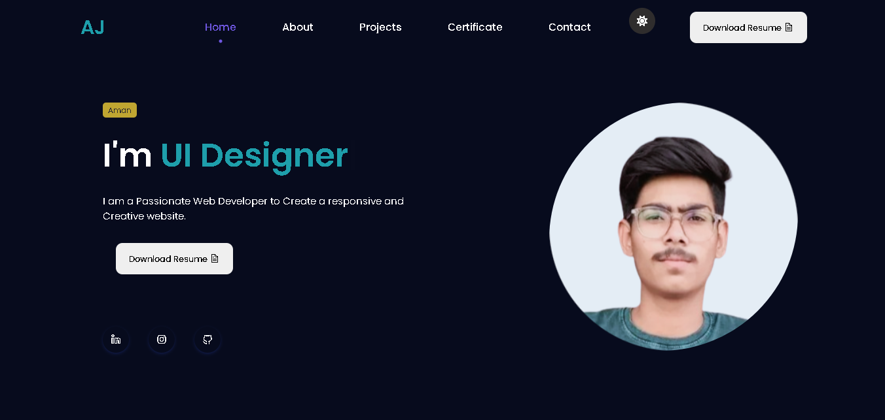

<h1 align="center">Hi 👋, I'm Aman</h1>

- 🔭 I’m currently working on **Full Stack Projects**
- 🌱 I’m currently learning **React, MongoDB**
- 💬 Ask me about **MERN Stack, Web Dev**
- 📫 How to reach me: **aj123@email.com**
- 📄 Know about my [Resume](#)

---

## 🏆 GitHub Trophies

---

## 🔥 GitHub Stats

  
  

---

## 📌 Pinned Repositories
Here are a few notable projects:
- 🧳 [Wanderlust Full Stack](https://github.com/aj990813/wanderlust)
- 🌦️ [Weather React App](https://github.com/aj990813/weather-app)
- 🌐 [Portfolio Website](https://github.com/aj990813/PORTFOLIO)

---

📷 Screenshots
 
> 

A sleek and responsive Portfolio Website built to showcase my skills, projects, and background as a full-stack web developer. Designed with a focus on performance, minimalism, and mobile-first responsiveness.

> 📌 Live Demo: https://aj007.netlify.app/

---

🛠 Tech Stack

Frontend: HTML, CSS, JavaScript

Styling: Bootstrap / Custom CSS

Icons: FontAwesome / React Icons

Hosting: Hostinger / GitHub Pages / Vercel

---

✨ Features

👨‍💻 About Me section

🛠️ Skills with icons or progress bars

📁 Projects with links and screenshots

📞 Contact form (email integration via Formspree / EmailJS)

📄 Resume download option

📱 Fully Responsive on all screen sizes

